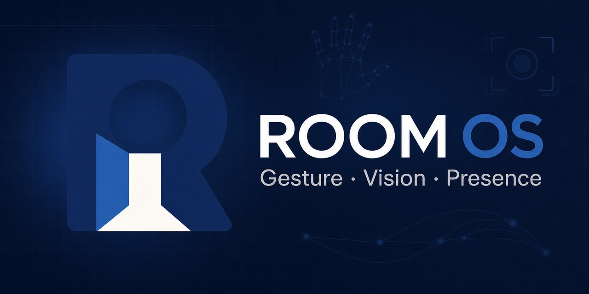
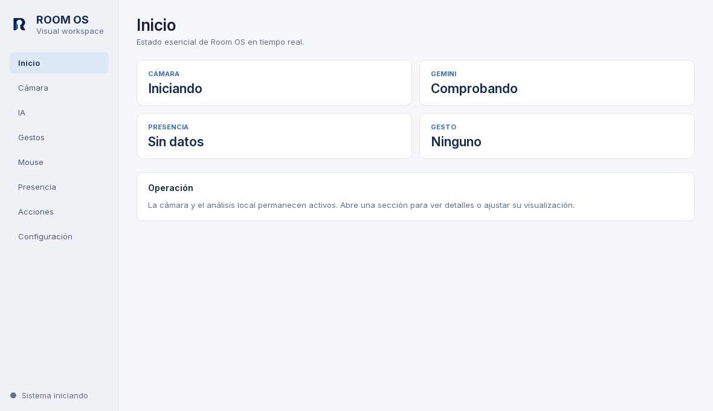
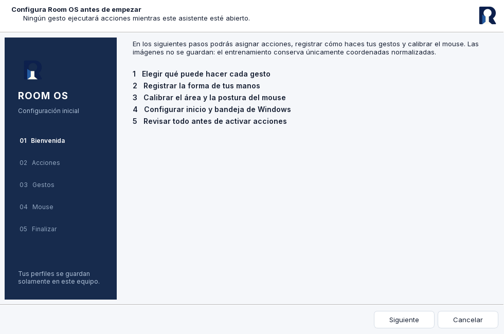

<p align="center">
  
</p>

<p align="center">
  <a href="README.md">English</a> ·
  <a href="https://github.com/diegomoren-lgtm/room-os/releases/latest">Descargar</a> ·
  <a href="ROADMAP.md">Roadmap</a> ·
  <a href="CONTRIBUTING.md">Contribuir</a>
</p>

# Room OS

Room OS es una aplicación modular que convierte una webcam común en una capa de
control visual para Windows. La cámara, las manos, los gestos, la presencia, las
acciones y la IA visual opcional se comunican mediante un `EventBus` y permanecen
desacoplados.

## Funciones principales

- Cámara en tiempo real con detección automática.
- Seguimiento de una o dos manos mediante MediaPipe.
- Gestos calibrables y acciones configurables.
- Mouse virtual con calibración guiada y suavizado.
- Presencia y reconocimiento facial procesados localmente.
- Registro ampliable de acciones permitidas para Windows.
- Análisis visual opcional con Gemini y rate limiting.
- Asistente inicial, interfaz PySide6 y configuración persistente.

## Interfaz

| Inicio | Configuración guiada |
| --- | --- |
|  |  |

## Descargar para Windows

1. Abre la [versión más reciente](https://github.com/diegomoren-lgtm/room-os/releases/latest).
2. Descarga `Room-OS-v0.1.0-windows-x64.zip`.
3. Extrae la carpeta completa y ejecuta `Room OS.exe`.

Los binarios actuales no están firmados digitalmente. También puedes compilar el
programa directamente desde el código público.

## Instalar para desarrollo

```powershell
git clone https://github.com/diegomoren-lgtm/room-os.git
cd room-os
py -3.11 -m venv .venv
.\.venv\Scripts\Activate.ps1
python -m pip install --upgrade pip
python -m pip install -r requirements.txt
python main.py
```

Ejecutar pruebas:

```powershell
python -m unittest discover -s tests -v
```

## Gemini opcional

La clave se lee únicamente desde `GEMINI_API_KEY`. No se almacena en el código,
la configuración ni los logs. Una imagen sale de la computadora solamente cuando
el usuario solicita explícitamente un análisis.

## Privacidad

- `data/` no se publica y puede contener perfiles, calibraciones y logs.
- Manos, presencia y reconocimiento facial funcionan localmente.
- Las aplicaciones que pueden abrirse están en una lista permitida.
- Las entradas externas se validan y el texto enriquecido se escapa.

Consulta [Seguridad](docs/SECURITY.md), el [roadmap](ROADMAP.md) y la
[guía de contribución](CONTRIBUTING.md).

Room OS se distribuye bajo la [licencia MIT](LICENSE).
