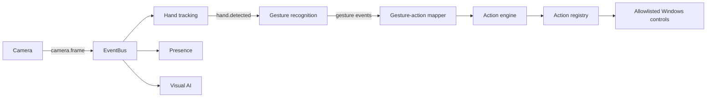

<p align="center">
  
</p>

<p align="center">
  <a href="https://github.com/diegomoren-lgtm/room-os/actions/workflows/tests.yml"></a>
  <a href="https://github.com/diegomoren-lgtm/room-os/releases/latest"></a>
  <a href="LICENSE"></a>
  
  
</p>

<p align="center">
  A modular Windows workspace controlled through gestures, vision and presence.
  <br>
  <a href="README.es.md">Leer en español</a> ·
  <a href="https://github.com/diegomoren-lgtm/room-os/releases/latest">Download</a> ·
  <a href="ROADMAP.md">Roadmap</a> ·
  <a href="CONTRIBUTING.md">Contribute</a>
</p>

## What is Room OS?

Room OS is an experimental desktop application that turns a regular webcam into
a visual control layer for Windows. Its modules communicate through an event bus,
so camera capture, hand tracking, gesture recognition, presence, actions and
optional visual AI remain independent and replaceable.

The project focuses on transparent local processing, explicit calibration and a
desktop interface that lets the user understand what the system is detecting.

## Highlights

- Real-time camera capture with automatic device detection.
- One- or two-hand tracking through MediaPipe and OpenCV.
- Calibrated gestures including palm, peace, point, pinch and thumb poses.
- Virtual mouse with guided calibration, smoothing and safety controls.
- Local presence and face recognition with no cloud dependency.
- Extensible action registry for Windows, media and allowlisted applications.
- Optional Gemini image analysis, invoked only when requested.
- First-run setup wizard and persistent per-device settings.
- Input validation, rate limiting and escaped rich text at trust boundaries.

## Interface

| Dashboard | Guided setup |
| --- | --- |
|  |  |

## Download for Windows

1. Open the [latest release](https://github.com/diegomoren-lgtm/room-os/releases/latest).
2. Download `Room-OS-v0.1.0-windows-x64.zip`.
3. Extract the complete folder and run `Room OS.exe`.

The current builds are not code-signed. Windows may identify them as coming from
an unknown publisher. If you prefer, build the application locally from the
auditable source using the instructions below.

## Development setup

Requirements: Windows 10 or 11, Python 3.11 and a webcam.

```powershell
git clone https://github.com/diegomoren-lgtm/room-os.git
cd room-os
py -3.11 -m venv .venv
.\.venv\Scripts\Activate.ps1
python -m pip install --upgrade pip
python -m pip install -r requirements.txt
python main.py
```

Run the test suite without a webcam or a live API request:

```powershell
python -m unittest discover -s tests -v
```

Build the distributable Windows folder:

```powershell
python -m pip install -r requirements-dev.txt
powershell -ExecutionPolicy Bypass -File scripts\build_windows.ps1
```

## Optional Gemini vision

Gemini is disabled gracefully when no credential is available. Room OS reads the
credential only from the `GEMINI_API_KEY` environment variable; it is never stored
in source, settings or logs.

```powershell
[Environment]::SetEnvironmentVariable(
    "GEMINI_API_KEY",
    (Read-Host "Gemini API key"),
    "User"
)
```

An image leaves the computer only after the user explicitly requests a Gemini
analysis. See [Gemini vision and privacy](docs/VISUAL_AI_GEMINI.md).

## Architecture

```text
room_os/
├── core/       Event bus, action engine, settings and security primitives
├── modules/    Camera, hands, gestures, mouse, presence and visual AI
├── platforms/  Allowlisted Windows integrations
├── services/   Gemini, face embeddings and local face storage
├── ui/         Desktop pages, theme and first-run wizard
├── scripts/    Diagnostics, build and installation utilities
├── tests/      Unit and local integration tests
└── docs/       Module, privacy and security documentation
```



## Privacy and safety

- Face images, embeddings, calibrations, logs and local settings are ignored by Git.
- Hand, presence and face processing run locally.
- Raw unknown faces are not saved by default.
- App launches are allowlisted; event payloads cannot provide arbitrary paths.
- API credentials are environment-only and redacted from errors.

Read the full [security policy](docs/SECURITY.md).

## Project status

Room OS is currently a beta-quality personal research project. Hardware behavior
varies across webcams, lighting conditions and Windows configurations. Bug reports,
calibration feedback and focused contributions are welcome.

See the [roadmap](ROADMAP.md), [open an issue](https://github.com/diegomoren-lgtm/room-os/issues)
or read the [contribution guide](CONTRIBUTING.md).

## License

Room OS is released under the [MIT License](LICENSE).
